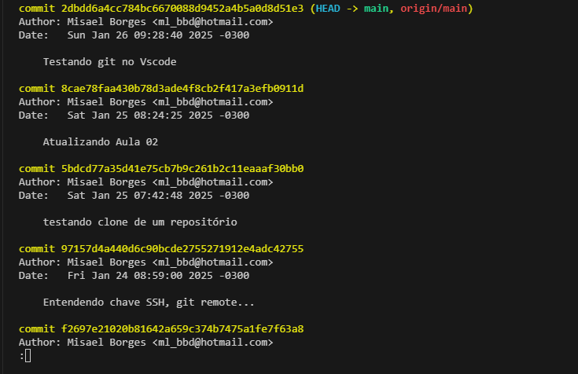

# Desfazendo um commit

É super comum querer desfazer um commit no Git, principalmente quando a gente percebe algum erro ou simplesmente quer voltar para uma versão anterior do projeto. **A boa notícia é que o Git te dá várias ferramentas para isso!**

```
Cada commit representa uma versão do código que fica registrada no histórico. 
```

## 1º Passo

Com o `git log` é possível trazer as informações dos últimos commits.



## 2º Passo 

- `git reset <id commit>`: Utilize o `git reset` + `id` do commit que quer desfazer.

### Exemplo

```
git reset 8cae78faa430b78d3ade4f8cb2f417a3efb0911d
```

### Importante

**Desfazer um commit não significa excluir as alterações**. Eles geralmente voltam para a área de staging ou ficam como alterações não acompanhadas.

## Resetando um commit 

Para **resetar** apagar um commit:

```
git reset --hard <id do commit ANTERIOR a ser apagado>
```

#### Esse comando é interressante de ser usado apenas quando o commit tiver sido apenas de maneira local, não enviado o commit.

## Alterando o último commit

Utilize parâmetro `-amend` no comando `git commit` para alterar o último commit, sem a necessidade de apagá-lo.

```
git commit --amend -m "Alterando a mensagem do último commit"
```

Essa é uma situação comum. Eventualmente digitamos com pressa e acabamos errando a mensagem. Mas não queremos deixar aquela mensagem feia e errada.

Ou a situação pode ter sido a seguinte: você editou seis arquivos, por exemplo, e quando foi fazer o commit, você adicionou cinco e deixou um para trás. E então você fez o commit.

Também é possível fazer esse comando `-- amend`. Nesse caso você não iria alterar a mensagem, mas precisaria apenas adicionar o arquivo e fazer o commit com o `amend`.

### [Voltar ao menu - Git e GitHub compartilhando e colaborando em projetos](../menu.md)