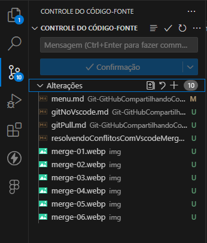
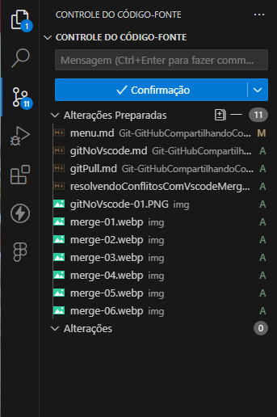
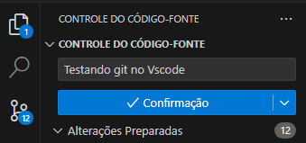
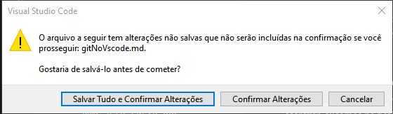

# Git no VSCode

Existe a opção de usar o Git pelo prompt de comandos, seja o **prompt do Windows** ou o **integrado no Visual Studio Code**, mas também, existe uma integração do próprio VS Code que facilita esse processo, de uma forma visual, com ícones. Portanto, vamos aprender a usar esse recurso.

Na barra de menu, na lateral esquerda da janela, temos o ícone do Explorador, que é o primeiro, seguido do de Busca, que é o segundo.

O terceiro ícone, que tem forma de um Y com círculos nas extremidades, é, justamente, o ícone da integração do Git dentro do VS Code, chamada **"Source Control"** (Controle de Origem). Clicando nessa opção, abrimos uma aba onde mostra, de maneira visual, todas as alterações no código, e nós podemos fazer o `commit`, o `pull`, o `push`, tudo diretamente pela interface.

Ao clicarmos, a aba que abre à direita da barra mostra uma lista suspensa chamada **"Changes" (Alterações)**, que podemos minimizar ou expandir. Dentro dessa lista estão todos os arquivos que foram alterados.

Para fazermos um commit, ele até destaca na parte superior dessa aba uma caixa de texto, para digitarmos a mensagem, e um botão azul abaixo dela, escrito "Commit", para realizarmos o commit. Lembrando que, antes de fazermos o commit, temos que adicionar os arquivos.

Ao passarmos o mouse sobre cada um dos arquivos, ele mostra três ícones no lado direito do nome, sendo eles, da esquerda para direita:

- **Open file (Abrir arquivo)**: clicando nele, abrimos o arquivo alterado. Esse ícone tem o formato de uma folha de papel com o canto superior direito dobrado e uma seta de retorno no canto superior esquerdo da folha;
- **Discard Changes (Descartar mudanças)**: ao ser clicado, esse botão desfaz as mudanças no arquivo. Podemos clicar nele quando alteramos arquivos por engano. Ele tem o formato de uma seta curva que aponta para esquerda;
- **Stage Changes (Preparar mudanças)**: clicando nele, adicionamos o arquivo ao próximo commit. O ícone é um sinal de mais.

Clicaremos no botão **"Stage Changes"** nos  arquivos. Agora a lista **"Changes"** está vazia e os dois arquivos passaram para uma nova lista suspensa na parte superior chamada **"Staged Changes" (Alterações preparadas)**. São as alterações que já foram adicionadas e já podemos realizar o commit. 

Antes de fazer é necessário digitar a mensagem que descreve o **commit**.

Então, podemos realizar o commit.

A princípio, ele realizou o commit e o botão azul mudou o texto para "Sync Changes 1" (Sincronizar Mudanças 1), ou seja, se tornou um botão de sincronização. Ele detectou que há um commit no meu repositório local, mas que ele ainda não foi enviado para o GitHub.

Então, é exibido esse botão para sincronizar as mudanças com o repositório remoto. Ao clicarmos no botão "Sync Changes 1", os dados devem ser enviados para o GitHub. Para isso, apareceu um alerta no centro da tela com uma mensagem informando que essa ação sincroniza com o "origin/main".

Isso significa que ele enviará para o seu repositório remoto o que está na branch main. Esse alerta aparece em uma janela onde na parte inferior tem três botões:

- **Ok**: para confirmar;
- **Ok, Don't Show Again" (Ok, Não mostre de novo)**: para confirmar a ação e não mostrar esse pop-up todas as vezes que fizermos um commit;
- **Cancel (Cancelar)**: para cancelar o commit caso tenhamos clicado por engano.

Clicaremos no segundo botão, para confirmarmos o commit e essa mensagem não aparecer novamente. Após clicarmos, ele irá sincronizar as mudanças, o que pode demorar um pouco. Após concluir, o botão da aba do Git fica desativado e volta ao texto "Commit".

### [Voltar ao menu - Git e GitHub compartilhando e colaborando em projetos](../menu.md)