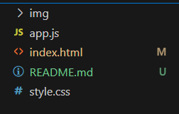

# Sinalizações em Arquivos do VSCode

Quando estamos trabalhando em um projeto utilizando o versionamento Git e a IDE VSCode, ao adicionar ou alterar algum arquivo aparece uma sinalização ao lado do nome desses arquivos no VSCode, como podemos ver na imagem abaixo:

### Mas o que isso significa?

- **M**: A letra M representa o estado Modified, do português modificado. Isso significa que o arquivo já existia no repositório, mas que recebeu alguma modificação que ainda não foi registrada no Git.

- **U**: A letra U representa o estado Untracked, do português não rastreado. Isso significa que o arquivo ainda não existia no repositório e que ainda não teve seu registro (commit) feito no Git.

Essa sinalização nos ajuda a entender o estado atual dos nossos arquivos do projeto no versionamento Git.

### [Voltar ao menu - Git e GitHub compartilhando e colaborando em projetos](../menu.md)