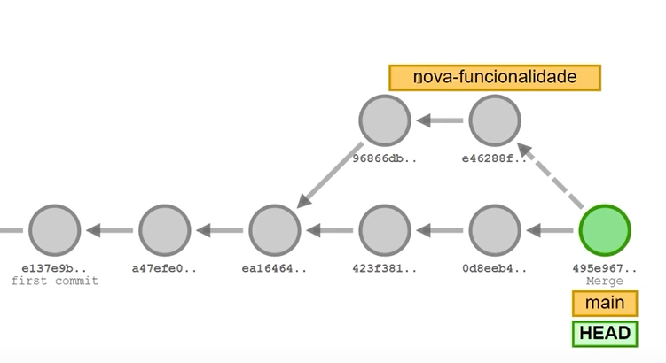

# Atualizando a branch

No Visualizing Git, encontramos o cenário que reproduzimos na última aula.



Temos a branch principal, ramificamos uma nova funcionalidade, criamos dois commits e depois fizemos um merge, ou seja, um novo commit foi criado com a junção desses dois trabalhos. Basicamente, é isso que fazemos quando temos um merge, quando temos dois trabalhos bifurcados.

Agora, criaremos um novo cenário. Então, rodamos o comando `clear` para limpar o Visualizing Git.

```
clear
```

Em sequencia, adicionamos uma nova branch chamada `main`, então passamos `git checkout -b main`.

```
git checkout -b main
```

Em sequência, removemos a branch chamada `master` para já nos adaptarmos com os nomes corretos. Então passamos o comando `git branch -d master`.

```
git branch -d master
```

<div style="background-color: white; color: black;">
<hr>

Recapitulando, o **git checkout** é um comando antigo que faz muita coisa. Contudo, o Visualizing Git não foi atualizado para ter o comando **git switch**. Mas, normalmente, utilizamos o comando **git switch**, que é mais simples.

<hr>
<hr>
</div>

Continuando, adicionaremos alguns commits na branch `main`, faremos isso sem mensagem, só commits vazios. Passamos `git commit` duas vezes.

```
git commit
```

Agora criaremos um novo branch passando `git branch nova-funcionalidade`.

```
git branch nova-funcionalidade
```

Criamos um novo branch, mas ainda estamos na `main`, não na `nova-funcionalidade`. Após, adicionamos mais dois commits na branch `main` passando `git commit`.

Agora, voltamos para o `git checkout nova-funcionalidade` para trabalharmos nela.

```
git checkout nova-funcionalidade
```

Em seguida adicionamos dois commits, passando duas vezes o código abaixo.

```
git commit
```

O cenário que montamos no Visualizing Git, criamos uma nova branch chamada `nova-funcionalidade` e estamos trabalhando nela. Enquanto trabalho nessa branch, outras pessoas podem ter criado outros branches e já se uniram à linha principal, à `main`. Normalmente, essa `main` é o projeto final que pode ser enviado à produção. É o projeto com todas as funcionalidades que estejam completas.

Estamos criando uma nova funcionalidade, porém queremos testá-la na versão mais recente do projeto. Repare que, a partir do momento em que criamos a `nova-funcionalidade`, dois outros commits também foram criados, ou seja, duas funcionalidades foram adicionadas no projeto principal.

Queremos garantir que o que estamos desenvolvendo funcione, mesmo com as funcionalidades que as outras pessoas criaram. Queremos garantir que tudo se integre da forma correta.

Sendo assim, queremos fazer com que a branch `nova-funcionalidade` não seja criada a partir da versão antiga da branch `main` e sim da versão mais nova.

Portanto, queremos reescrever a história, fazendo com que o primeiro commit da nova funcionalidade venha logo após do momento atual da `main` atualizada. Queremos fazer com que a branch `nova-funcionalidade`, seja reescrito para ter todas as funcionalidades da `main` antes dela.

Isso pode ser feito com um comando mágico chamado `git rebase`, que faz muita coisa, como reescrever a história dos commits. Então, se estivermos em `nova-funcionalidade` e executarmos o comando `git rebase main`, ele pegará todos os commits da `main` que não estão na branch `nova-funcionalidade`, e tentar adicionar um a um antes da branch `nova-funcionalidade`.

```
git rebase main
```

Ele pegará o primeiro commit e tentar adicionar antes do commit `nova-funcionalidade`. Pegará o próximo commit, que é o último da `main`, e tentar adicionar antes do commit `nova-funcionalidade`. Após isso, pega todos os commits da `nova-funcionalidade` e aplica depois do último da `main`.

Pode parecer bastante complexo, mas se visualizarmos o que está acontecendo, talvez fique um pouco mais fácil. Ele primeiro traz o head para a `main` e depois aplica tudo da `nova-funcionalidade`, cada um dos commits, depois. Vai aplicando commit a commit depois da última coisa que estiver na `main`.

Recapitulando novamente. Temos duas branches independentes, uma `main` e uma `nova-funcionalidade`. Se queremos garantir que essa `nova-funcionalidade` agora tenha tudo o que tem na `main` também, podemos fazer o `rebase`.

O `rebase` fará o quê? Se estamos na `nova-funcionalidade` e tentamos fazer o `rebase` com a `main`, ele vai alterar o branch para ir para a `main`. Depois da `main`, ele vai aplicando cada um dos commits da `nova-funcionalidade`. Isso é feito commit por commit, porque se tiver algum conflito em algum dos commits, vamos resolvendo um a um. Dessa forma, conseguimos reescrever a história.

Reparem que agora o `nova-funcionalidade` possui dois commits com hashes diferentes, porque vieram de outro lugar a partir de uma nova história. Vamos fazer isso, na prática.

Para isso, abrimos o projeto no VS Code, limpamos o terminal e passamos o comando `git status`.

```
git status
```

Agora estamos na `main`. Então, passamos o comando `git switch -c nova-funcionalidade`. Vou criar mais uma `nova-funcionalidade`.

```
git switch -c nova-funcionalidade
```

Agora, corrigiremos a indentação do link na linha 10 para que o atributo `rel` esteja na mesma coluna do meu atributo `href`. Fizemos uma alteração simples.

No terminal, adicionamos esse commit. Então, escrevemos `git add index.html`.

```
git add index.html
```

Seguido de `git commit -m "Corrigindo indentação"`.

```
git commit -m "Corrigindo indentação"
```
Vamos quebrar também o `<script>` para que a abertura e o fechamento dessa tag fiquem em linhas diferentes.

```
//Código omitido

<script src="https://code.responsivevoice.org/responsivevoice.js">
</script>

//Código omitido
```

Feito isso, no terminal passamos `git add index.html`, seguido de `git commit -m "Quebrando linha do script"`.

```
git commit -m "Quebrando linha do script"
```

Temos a `nova-funcionalidade` sendo desenvolvida. Agora, faremos o `git switch` para `main`. Imagine que alguma outra nova funcionalidade será adicionada no ramo principal.

Quebraremos a linha referente ao botão de chute para que o texto `Chutar` fique separado das tags de abrir e fechar `<button>`. Fazemos o mesmo em `Novo Jogo`.

```
//Código omitido

    <div class="chute container__botoes">
            <button onclick="verificarChute()" class="container__botao">
                Chutar
            </button>
            <button onclick="reiniciarJogo()" id="reiniciar" class="container__botao" disabled>
                Novo jogo
            </button>
    </div>
</div>

//Código omitido
```

Feito isso, salvamos. No terminal, adicionamos `git add index.html`, seguido do `git commit -m "Indentando botões"`.

```
git commit -m "Indentando botões"
```

Na branch `main`, temos uma nova funcionalidade que indentou os botões. Se fazemos `git switch nova-funcionalidade`, temos a indentação das tags no início do arquivo. Só que queremos garantir que o arquivo `index.html` esteja correto mesmo se pegarmos tudo da última versão da `main`. Então, primeiro passamos o comando `git log --`.

```
git log --
```

Assim é exibido que temos `Corrigindo indentação`, mostrando a linha do script depois do `origin/main`, mas não do `main/local`, pois tem um commit novo. Limpamos a tela e passamos o `git rebase main`.

```
git rebase main
```

Isso faz um `git switch` para `main`, pega cada um dos commits que temos nessa `nova-funcionalidade` e tenta aplicar a partir desse novo momento. Depois, move novo branch para a nova linha. Então, fazemos o `git rebase main`.

```
git rebase main
```

Repare que primeiro, estamos fazendo o rewind, ou seja, estamos voltando para o início dessa branch. Depois, estamos aplicando o commit de corrigir a indentação e aplicamos o commit de quebrando a linha do script. Deu tudo certo!

Se passarmos `git log` agora, reparem que o branch nova-funcionalidade começa a partir do branch `main`, do novo `main` que criamos localmente. Então, reescrevi a história. Agora, podemos fazer o `git push origin main`.

```
git push origin main
```

Seguido de `git push origin nova-funcionalidade`.

```
git push origin nova-funcionalidade
```

Estamos mandando tudo para o repositório remoto. Claro, podemos voltar para o `git switch` main e fazer um `git merge nova-funcionalidade`.

Com isso, ele vai conseguir fazer o fast-forward porque já fiz o `rebase`, então não precisa daquele commit de merge. Porque, novamente, ele já reescreveu a história garantindo que os dois branches não sejam mais separados e sim que podem estar juntos.

Reparem que quando fazemos o `merge`, conseguimos fazer o `fast-forward`. Então, agora, novamente fazemos o `git push origin main` que agora tem a `nova-funcionalidade`.

Um detalhe importante antes de finalizar e que `fast-forward`, `commit` de `merge`, parecem ser detalhes bem pequenos e, na verdade, são. Quando estamos trabalhando, podemos simplesmente executar o `git merge` sem saber se ele vai fazer o `fast-forward` ou se vai fazer um commit de `merge`.

Porém, em algumas empresas, podem ter políticas onde todos os merges precisem ser feitos com o `fast-forward`. Então, antes de qualquer `merge`, é preciso fazer um `rebase`.

Também pode ser o contrário, precisamos garantir que nunca utilizaremos o `fast-forward` para sempre ter no grafo do log as ramificações. Então, podemos utilizar estratégias para isso também.

Mas, para o nosso cenário, já é o suficiente conhecer os comandos `merge` para mesclar trabalhos e o comando `rebase` para reescrever a história e garantir que uma nova branch possa ser atualizada a partir de uma branch anterior.

Já temos bastante conteúdo sobre o trabalho com branches. Agora, falaremos sobre manipular o que temos de versão. Por exemplo, se temos um trabalho que teremos que abandonar para corrigir um bug ou situações semelhantes, como podemos guardá-lo para depois e desfazer trabalhos?

### [Voltar ao Menu - Git e GitHub: dominando controle de versão de código](../menu.md)