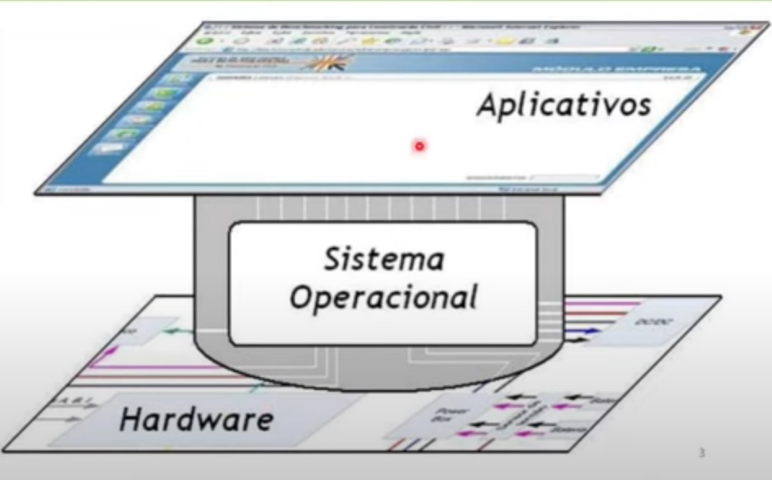

# Sistemas operacionais

## Introdução aos SO's

Para que um determinado dispositivo funcione é necessário que exista um **software básico** instalado na máquina fisica, este programa é conhecido como **Sistema Operacional (SO)**.

## Pra que servem os Sistemas Operacionais?

A **máquina** opera com cadeias de *códigos binários* enquanto o **homem** opera com *estruturas mais abstratas* como conjuntos, arquivos, algorítmos... O **Sistema Operacional** vem para oferecer uma interface mais amigável, mais fácil de entender.

```
É uma CAMADA DE SOFTWARE colocada entre o HARDWARE e os PROGRAMAS do usuário.
```



## Programas Computacionais

Podem ser divididos em dois tipos:

1. **Programas dos sistema**: que manipulam a *operação do computador*.
    - O programa de sistema mais importante é o **sistema operacional**, que controla todos os recursos do computador e dá base de sustentação para a execução de **programas aplicativos**.
2. **Programas aplicativos**, que resolvem *problemas para o usuário*. 

## Mas o que é SO?

Há duas formas de compreender um SO:

### 1. O **SO como uma máquina virtual** 

- Todo dispositivo possui uma **linguagem de máquina** bastante primitiva e, humanamente, difícil de compreender.

- Neste caso, o **SO** é o programa resposável por **esconder os detalhes de implementação, gerando abstrações de mais alto nível**.

    - A **abstração** apresentada ao usuário pelo sistema operacional **é simples e mais fácil de usar que o do hardware original**.

- Nesta visão, a **função do sistema operacional** é apresentada ao usuário como uma **máquina estendida** ou **máquina virtual** que é mais fácil de interagir e programar.

### 2. O SO como um gerenciador de recursos

- Nossos dispositivos são compostos de vários subsistemas: 
    - processadores;
    - memórias:
    - discos;
    - dispositivos de Entrada/Saída;
- Nesta visão, o **SO** tem como função **gerenciar de forma adequada esses recursos**, conciliando ainda, às requisições do usuário de forma ,ais rápida e confiável possível.
- Desse modo, o **SO** é o responsável pela **distribuição de forma otimizada da CPU** entre as tarefas em execução.

### [Voltar ao Menu - Terminal: aprenda comandos para executar tarefas](../menu.md)