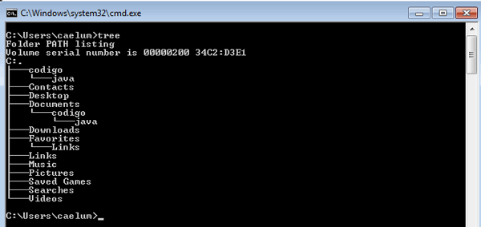

# O comando tree

Quando estamos trabalhando com o prompt de comando temos à disposição diversos comandos. Um dos mais interessantes é o comando `tree`, que nos mostra a estrutura de pastas do sistema.

Vamos fazer mais um teste! No prompt, digite o comando `tree`:

Dependendo do diretório atual, muitas informações podem aparecer; mas, repare que o comando `tree` mostra as pastas e subpastas organizadas em uma árvore.

O `tree` pode ser útil para entender a estrutura de um projeto. Com esse comando, você já pode ver facilmente como o projeto está organizado! É um recurso muito útil!

### [Voltar ao Menu - Windows Prompt: utilizando o CMD](../menu.md)