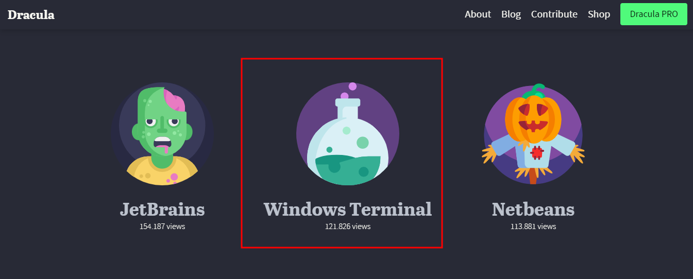
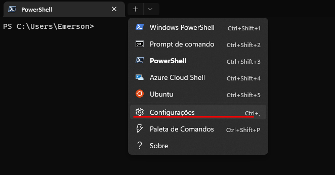
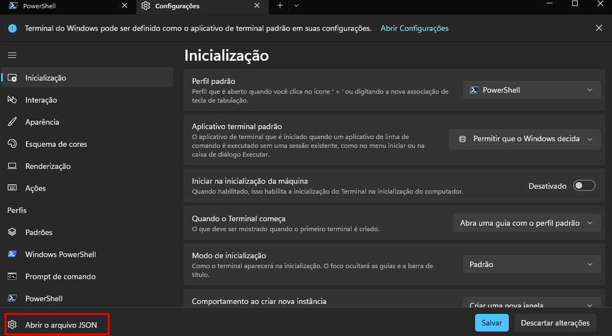
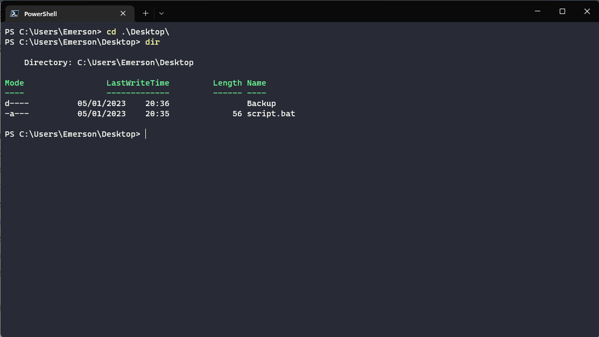

# Alternativas de Customização do Terminal (Dracula)

Customizar o terminal pode ser um trabalho árduo e que muitas vezes leva muito tempo. São vários fatores a serem pensados para chegar num tema com cores que permitam trabalhar por horas sem ferir os olhos, utilizando fontes e cores agradáveis e intuitivas, dentre outros aspectos que podem ser considerados.

Porém, existem diversas soluções prontas para evitarmos esse trabalho de estilização, como o tema “Dracula”, que é bem famoso entre as pessoas desenvolvedoras. E é com ele que vamos estilizar nosso Windows Terminal!

Para isso, vamos acessar o site do [Dracula](https://draculatheme.com/) e selecionar o **Windows Terminal**



Na sequência, abra o Windows Terminal e clique no ícone da seta para baixo no menu superior. Nele, nós abriremos as configurações. Se preferir, você pode usar o atalho `Ctrl + ,`.



Em seguida, clique em **Abrir o arquivo JSON** no canto inferior esquerdo (ou use o atalho `Ctrl + Shift + ,`).



Com o arquivo `settings.json` aberto, nós iremos buscar pela seção schemes e adicionar após o símbolo `[` o código descrito no site do Dracula:

```
   {
        "name": "Dracula",
        "cursorColor": "#F8F8F2",
        "selectionBackground": "#44475A",
        "background": "#282A36",
        "foreground": "#F8F8F2",
        "black": "#21222C",
        "blue": "#BD93F9",
        "cyan": "#8BE9FD",
        "green": "#50FA7B",
        "purple": "#FF79C6",
        "red": "#FF5555",
        "white": "#F8F8F2",
        "yellow": "#F1FA8C",
        "brightBlack": "#6272A4",
        "brightBlue": "#D6ACFF",
        "brightCyan": "#A4FFFF",
        "brightGreen": "#69FF94",
        "brightPurple": "#FF92DF",
        "brightRed": "#FF6E6E",
        "brightWhite": "#FFFFFF",
        "brightYellow": "#FFFFA5"
    }
```

Após esse procedimento, com `settings.json` ainda aberto, iremos buscar a seção **profiles** e substituí-lo pelo seguinte código descrito no site do Dracula:

```
"profiles": {
    "defaults": {
        "colorScheme" : "Dracula"
    }
}
```

Se os perfis estiverem listados assim:

```
"profiles": [
    // lista de perfis
]
```

Mude para:

```
"profiles": {
    "defaults": {
      "colorScheme": "Dracula"
    },
    "list": [
      // list of profiles
    ]
  },
```

Assim, podemos fechar nosso arquivo e o terminal. Ao abrir o WIndows Terminal novamente, veremos que o Dracula foi instalado com sucesso:



### [Voltar ao Menu - Windows Prompt: utilizando o CMD](../menu.md)
