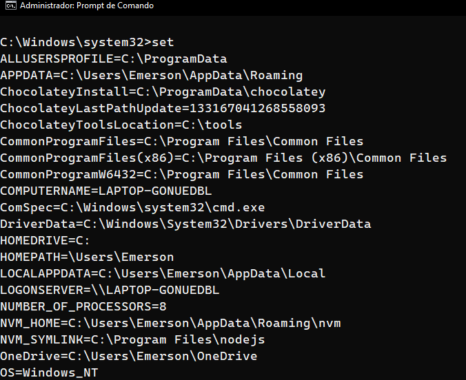

# Diferença entre SET e SETX

O comando **set** atribui os valores na sessão do cmd que está aberta e morre quando ela é finalizada. Esse comando está embutido no próprio cmd e é apenas reconhecível por ele.

Já o **setx** atribui os valores para todas as novas sessões do cmd que forem criadas e não os perde ao finalizar o terminal. As sessões que já estão rodando não são afetadas, por isso, é necessário fechar e abrir o cmd para observarmos as modificações. Com `/M` estamos indicando que a variável que estamos atribuindo será adicionada nas variáveis de sistema, podendo assim ser acessível para todos os usuários. É a única forma de modificar as variáveis de ambiente programaticamente.

A diferença, então, é que o **setx** altera as variáveis permanentemente, enquanto o **set** altera apenas enquanto o terminal está aberto.

Outra diferença, também, é que com o comando `set` podemos imprimir todas as variáveis de ambiente.

Caso queira entender mais detalhes, você pode consultar a [documentação oficial da Microsoft](https://learn.microsoft.com/pt-br/windows-server/administration/windows-commands/setx) sobre os comandos.

### [Voltar ao Menu - Windows Prompt: utilizando o CMD](../menu.md)