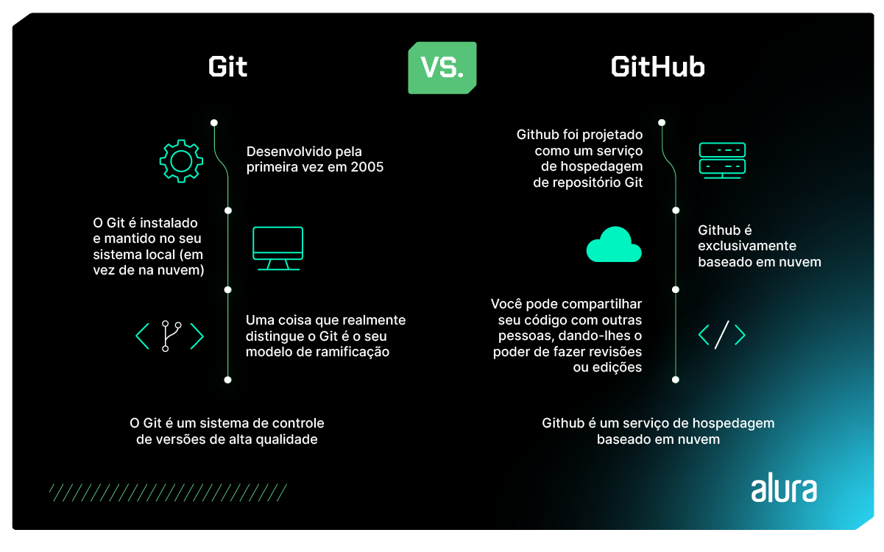
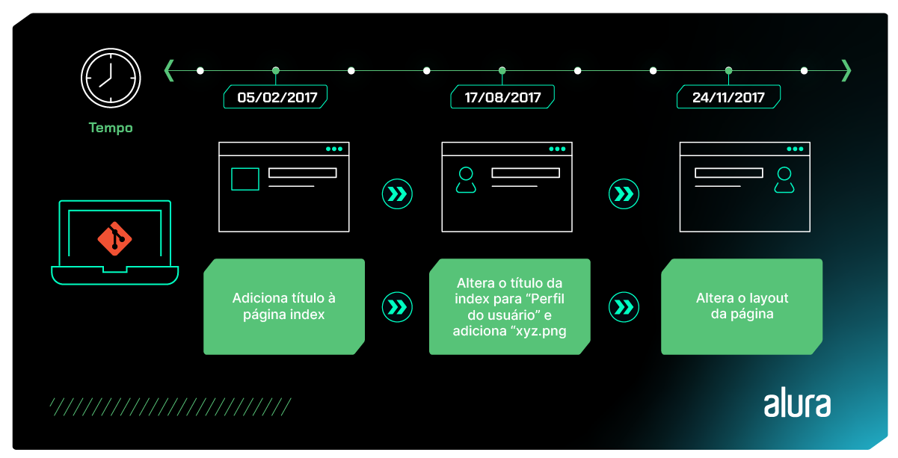
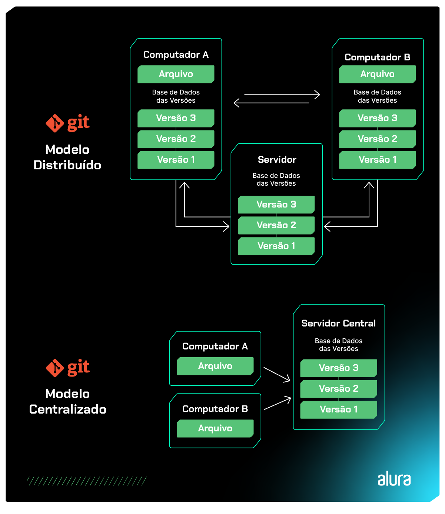

# O que é Git e Github: os primeiros passos nessas ferramentas


Pense na seguinte situação: você precisa gerenciar um projeto de desenvolvimento de software que envolve uma equipe em nível global de pessoas desenvolvedoras.

Imagina o desafio que é quando cada uma das pessoas contribui com uma parte do código?

Na Alura, por exemplo, o time de desenvolvimento é segmentado em diferentes funções: há uma equipe que desenvolve as interfaces visuais da plataforma e outra que processa toda a operação da plataforma.

Como podemos assegurar que todas as peças vão se encaixar perfeitamente? Como garantir um trabalho em conjunto harmonioso?

É aí que entram as ferramentas **Git e GitHub**, que, como você vai ver adiante, apresentam boas respostas para essas questões.

## Antes de mais nada, um panorama geral

Se você é dev ou está considerando entrar na área da tecnologia, é provável que já tenha se deparado com o termo "Git e Github".

À primeira vista, pode parecer que "Git" e "Github" são a mesma coisa, mas a resposta é **não**.

**São ferramentas distintas**, mas colaboram de maneira integrada para tornar o desenvolvimento de software mais eficiente.

Aqui está um resumo rápido sobre cada uma delas — que também nos ajuda a diferenciá-las:

```
O Github é uma “rede social dev” em que é possível armazenar e compartilhar projetos de desenvolvimento de software.

O Git é um sistema de controle de versão de arquivos; em outras palavras, é responsável por guardar o histórico de alterações sempre que alguém modificar algum arquivo que está sendo monitorado por ele.
```

Desta maneira, o Git e o GitHub são pilares fundamentais que auxiliam as equipes de desenvolvimento a controlar o versionamento de código, rastrear mudanças, colaborar de forma eficiente e garantir que o trabalho em equipe flua sem problemas.

Na imagem a seguir, podemos exemplificar melhor essas diferenças:



Ao longo deste artigo, vamos nos aprofundar sobre os serviços dessas duas tecnologias.

Quer desvendar os segredos do Git e GitHub? Então vamos lá.

## História do Git

Durante o período de 1991 a 2002 aconteceu a maior parte da manutenção do projeto de código aberto do núcleo do Linux. Diferentes pessoas eram responsáveis por essas mudanças e compartilhavam tarefas e arquivos.

Assim, em 2002, perceberam a necessidade de usar uma ferramenta de controle de versão distribuído (DVCS).

Na época, a ferramenta era a “BitKeeper” — um software proprietário, lançado sobre a licença Apache 2.0.

Foi então que, em 2005, a relação entre a comunidade de dev do Linux e a empresa por trás do BitKeeper ficou tensa. Vixe! O resultado disso foram diversas restrições e altos custos para usara ferramenta.

Essa situação levou a comunidade, e especialmente Linus Torvalds, o criador do Linux, a criar sua própria ferramenta de controle de versão, o Git, que ganhou o coração das pessoas que trabalham com open source.

Desde então, o Git passou por melhorias e se tornou uma ferramenta relativamente fácil de usar, mantendo suas características originais, como velocidade, eficiência em projetos grandes e um sistema de ramificação para o desenvolvimento não linear.

## O que é Git e para que serve?

Em uma equipe, apenas poder acessar o código de outras pessoas colaboradoras não é suficiente.

Mais do que isso: precisamos manter o **histórico** dos nossos arquivos e das nossas modificações.

Afinal de contas, muitas vezes mudamos arquivos em grupo, num movimento único — que, no contexto do Git, é um **commit**. O que, em tradução literal para português, significa “compromisso” ou “comprometer-se” às alterações em um repositório.

Dessa forma, podemos voltar atrás e **recuperar o estado do sistema**: como ele era ontem, ou no ano passado, comparar as mudanças para encontrar bugs e estudar otimizações.

Vamos conferir na imagem abaixo um exemplo de histórico de um projeto de desenvolvimento.



Na imagem acima há destaque para 3 commits:

**1 - “Adicionando título a página index”**: Neste primeiro commit percebemos que o dev responsável criou a estrutura inicial de uma página de perfil de usuário.

**2 - “Altera o título da index para Perfil do usuário e adiciona xyz.png”**: Neste segundo commit notamos que alteraram o título da página e acrescentaram uma nova imagem.

**3 - “Altera o layout da página”**: Neste terceiro commit, observamos que alteraram o layout da página de usuário, cores e posições de elementos. Com base nestes commits, se porventura o cliente não gostar da mudança de layout implementada no commit 3, o time desenvolvimento pode voltar o layout como era no commit 2.

Além disso, podemos identificar que cada um desses commits contam alguma história, a partir do seu motivo de criação.

Isso auxilia bastante quem está lendo a identificar o que está procurando.

## Como funciona o Git?

Mas como será que o Git guarda todas essas informações?

Todos os nossos arquivos, assim como seus históricos, ficam em um **repositório** e existiam vários sistemas que gerenciam repositórios assim, como CVS (Sistema de Versões Concorrentes) e SVN (Subversion do Apache).

O Git é uma alternativa com um funcionamento mais interessante ainda: ele é **distribuído** e todo mundo tem uma cópia inteira do **repositório**, não apenas o "servidor principal".

E uma das vantagens disso é que cada pessoa pode desenvolver offline, realizando seus commits e outras operações sem depender de uma conexão constante com o servidor principal.

Mas…o que é a ferramenta Git exatamente?

**O Git é um sistema de controle de versão distribuído e amplamente adotado**. O Git nasceu e foi tomando espaço dos outros sistemas de controle.

- #### [Vídeo - O que são Git e Github?](https://www.youtube.com/watch?v=P4BNi_yPehc)

## Como baixar e instalar o Git?

Para utilizar o Git, você pode seguir esse passo a passo de como fazer o download e instalar, para cada sistema operacional:

### Windows:

1. Acesse o site oficial do Git em "https://git-scm.com/download/win".
2. Clique no link para download do Git para Windows.
3. Após o download, execute o instalador.
4. Siga as instruções do instalador, aceitando as configurações padrão, se não for um usuário avançado.
5. Conclua a instalação.

### Linux:

1. No Linux, você pode instalar o Git usando o gerenciador de pacotes da sua distribuição. Por exemplo, no Ubuntu, use o comando sudo apt-get install git.
2. Se estiver usando outra distribuição, substitua o comando de acordo.

### macOS:

1. No macOS, o Git pode ser instalado de várias maneiras, incluindo o uso do Xcode Command Line Tools, que geralmente já está instalado no sistema.
2. Abra o Terminal e digite git --version para verificar se o Git está disponível. Se não estiver, o sistema solicitará a instalação.
3. Siga as instruções para instalar o Git. Com esses passos simples, você pode instalar o Git no seu sistema operacional e começar a usar essa poderosa ferramenta de controle de versão.

## Como executar o Git?

Depois de instalar o Git, você pode começar a usar o Git em um projeto. É só seguir essas etapas:

- ### 1. Configure seu nome de usuário e e-mail:

O Git registra quem fez cada alteração no código. Portanto, é importante configurar seu nome de usuário e e-mail. Use os comandos, no terminal:

```
git config --global user.name "Seu Nome"
git config --global user.email "seu@email.com"
```

- ### 2. Crie um Repositório Git:

Para começar a rastrear seu código, crie um repositório Git em seu projeto. Navegue até a pasta do seu projeto e execute:

```
git init
```

- ### 3. Adicione Arquivos ao Controle de Versão:

Use o comando git add para adicionar arquivos ao "staging area", que é onde você prepara os arquivos para serem “commitados” ou salvos.

```
git add nome-do-arquivo
```

- ### 4. Faça um Commit:

Um commit é um snapshot de suas alterações. Use o comando git commit para criar um commit com uma mensagem descritiva do que foi alterado no projeto.

```
git commit -m "Sua mensagem de commit aqui"
```

- ### 5. Visualize o Histórico de Commits:

Use git log para ver o histórico de commits no repositório.

```
git log
```

Essas são as etapas fundamentais para começar a usar o Git. Com esses comandos, você pode iniciar o controle de versão de seu código e colaborar em projetos com outras pessoas desenvolvedoras.

## Qual é a linguagem do Git?

Desde seu lançamento, a comunidade de desenvolvimento gradualmente passou a adotá-lo, especialmente devido à sua robustez como sistema de gerenciamento de versões e outras características — como ser rápido e distribuído.

Por este motivo, muitas pessoas que desenvolvem se perguntam em algum momento: "**Do que é feito o Git**"?

Inicialmente, por ser desenvolvido com o Linux em mente como plataforma, o Git foi desenvolvido em Shell Script que, apesar de funcionar como o esperado, amarrava a ferramenta a sistemas Linux, que tinham os utilitários necessários para interpretar o Shell Script.

Com a popularidade da ferramenta, outros sistemas buscaram dar suporte a ela, através da emulação de um sistema Linux, que ficava responsável por executar o Git.

No entanto, o uso da emulação de um sistema Linux tinha impacto na performance da ferramenta nos sistemas operacionais que usavam essa estratégia.

Tendo isso em mente, muitos comandos do Git, inicialmente escritos em Shell Script, foram reescritos na linguagem C, que resultou em ganho de performance em plataformas que não usam o Shell Script como linguagem de linha de comando oficial, como é o caso do Windows.

## Conceitos fundamentais do Git

Para o funcionamento do Git, existem conceitos com nomenclaturas um tanto diferentes, que são:

### Repositórios, commits e árvores (Trees)

Um **repositório** é como uma pasta ou diretório que contém todos os arquivos e o histórico de um projeto.

Já o termo commit pode ter como tradução literal “compromisso”, que seria uma ação em que você faz uma alteração no projeto, se compromete e salva suas alterações no histórico do projeto.

Ou seja, cada commit é uma entrada no histórico que contém informações sobre as alterações feitas.

Árvores, por último, representam a estrutura do diretório e arquivos em um commit específico, que tem como função registrar a organização do projeto ao longo do histórico de desenvolvimento.

### Ramificações (Branches) e fusões (Merges)

As **“ramificações”** ou **branches** permitem que você crie linhas separadas de desenvolvimento para trabalhar em recursos ou correções sem afetar a linha principal do projeto.

Cada **branch é uma ramificação independente do código-fonte**, possibilitando que você isole e desenvolva novas funcionalidades, refatore o código ou faça correções e testes em paralelo, sem interferir no código existente na branch principal, que geralmente é nomeada como "main".

Em um projeto com **branches** diferentes, a fusão, ou **merge**, permite combinar as alterações dessas **branches** de volta à linha principal, quando as alterações estão prontas.

### Controle de versão distribuído

Existem dois tipos de sistemas de controle de versão. Em um deles, pode haver um único servidor central que armazena o projeto com seu histórico, com o qual as pessoas desenvolvedoras precisam interagir. Isso é característico de um sistema de **Controle de Versão Centralizado**.

No outro tipo, cada pessoa desenvolvedora pode manter uma cópia do projeto em sua máquina local, o que é conhecido como **Controle de Versão Distribuído**, que é o caso do Git.

Com o Git, cada pessoa desenvolvedora tem uma versão completa do histórico do projeto. Isso proporciona independência e permite o desenvolvimento em paralelo.



## Quais são os principais comandos do Git?

O Git é uma ferramenta bastante robusta e oferece diversos utilitários para gerenciar as versões de um projeto em linha de comando. Confira os **principais comandos da ferramenta**:

- **Git init**;
- **Git clone**;
- **Git status**;
- **Git add**;
- **Git commit**;
- **Git log**;
- **Git branch**;
- **Git checkout**;
- **Git diff**.

### 1) Git init

É utilizado para inicializar um repositório Git dentro de um diretório do sistema. Após sua utilização, a ferramenta passa a monitorar o estado dos arquivos no projeto.

### 2) Git clone

É utilizado para **criar uma cópia de um repositório remoto em um diretório da máquina**. Este repositório poder ser criado a partir de um repositório armazenado localmente, através do caminho absoluto ou relativo, ou pode ser remoto, através do URI na rede.

A partir de um repositório clonado, é possível acompanhar o estado de um projeto e suas modificações, além de contribuir com o projeto, a partir do envio das suas modificações ao repositório central.

### 3) Git status

É utilizado para **verificar o status de um repositório git**, bem como o estado do repositório central. O comando mostra informações sobre se o projeto local está sincronizado com o central, quais arquivos estão sendo monitorados pelo Git e em qual branch você está no projeto.

### 4) Git add

É utilizado **para adicionar arquivos ao pacote de alterações a serem feitas**. É possível adicionar um único arquivo, múltiplos arquivos de uma vez, como `git add <-arquivo1-> <-arquivo2-> ...`, ou até mesmo um diretório, a partir de seu caminho. Uma vez que um arquivo é adicionado ao pacote de alterações com o comando `add`, ele está pronto para entrar no próximo `commit`.

### 5) Git commit

```
git commit -m "mensagem do commit"
```

É utilizado para **criar uma nova versão do projeto a partir de um pacote de alterações**. O commit pega o pacote de modificações adicionado através do comando git `add`, fecha essas alterações num pacote e o identifica através de um Hashcode.

Além disso, para cada commit é necessário escrever uma mensagem para identificá-lo, com uma mensagem clara de quais alterações foram feitas neste commit.

### 6) Git log

```
git log
```

É utilizado para ver o **histórico de alterações do projeto**, onde aparecerão todos os commits feitos, com suas respectivas mensagens e códigos identificadores.

O comando é muito útil quando precisamos rastrear o andamento de um projeto e verificar em qual ponto cada funcionalidade foi implementada.

Além disso, o comando conta com várias opções para mostrar o histórico de forma resumida, gráfica e até mesmo mostrando a diferença entre os commits, que podem ser vistas na [documentação oficial do comando](https://git-scm.com/docs/git-log/pt_BR).

### 7) Git branch

É utilizado para **criar novos ramos de desenvolvimento**, bem como visualizar quais são os ramos existentes.

Para criar um novo ramo, basta utilizar o comando git branch seguido do nome do novo ramo, e para visualizar quais os ramos existentes a utilização do comando é bem similar: basta não informar um nome para a nova branch, e serão listadas todas as já criadas.

### 8) Git checkout

É utilizado para **navegar entre as versões do projeto**, bem como entre as diferentes ramificações criadas. Para navegar entre as versões, basta usar o comando:

```
git checkout <- Hashcode do commit ->
```

E todo o estado do projeto se modificará ao estado no qual o commit foi feito.

Similarmente, para navegar entre as ramificações podemos usar o comando:

```
git checkout <- nome da branch ->
```

E a branch será alterada. O comando também permite criar uma branch e imediatamente mudar para ela, através do comando:

```
git checkout -b <- nome da branch ->
```

Que vai criar a ramificação e navegar até ela.

### 9) Git diff

É utilizado para **visualizar modificações feitas entre commits**, sejam eles entre um commit arbitrário e o estado atual do projeto, dois commits arbitrários, ou até mesmo todas alterações entre dois commits distintos.

Para visualizar as alterações entre um commit distinto e o atual, basta usar o comando:

```
git diff <- Hashcode do commit anterior ->
```

E serão listadas todas as diferenças no projeto entre os dois commits.

Para conhecer mais sobre o comando git diff e seus casos de uso, além de outros comandos e utilitários do Git, confira a [documentação do Git](https://git-scm.com/docs).

### 10) Git config 11) 

O comando git config é usado para configurar e personalizar o ambiente Git no seu sistema. Ele permite que você defina informações como seu nome de usuário, endereço de e-mail, editor padrão e muitas outras configurações que definem como o Git interage com seus repositórios.

A estrutura básica do comando é:

```
git config <opções> chave valor
```

- `<opções>`: Pode ser global (`--global`) para definir configurações para todos os repositórios no seu sistema ou local (`--local`) para definir configurações específicas para um repositório em particular.
- `chave`: A chave de configuração que você deseja definir (por exemplo, `user.name` para o nome de usuário).
- `valor`: O valor que você deseja atribuir à chave (por exemplo, seu nome de usuário ou endereço de e-mail).

Por exemplo, para configurar seu nome de usuário globalmente, você pode usar o comando:

```
git config --global user.name "Seu Nome"
```

Isso é útil para garantir que todos os commits que você fizer em qualquer repositório Git no seu sistema tenham o seu nome associado a eles.

Além disso, o comando `git config` pode ser usado para personalizar muitos outros aspectos do seu ambiente Git, tornando-o mais adaptado às suas preferências e necessidades.


### [Voltar ao README Principal](./README.md)